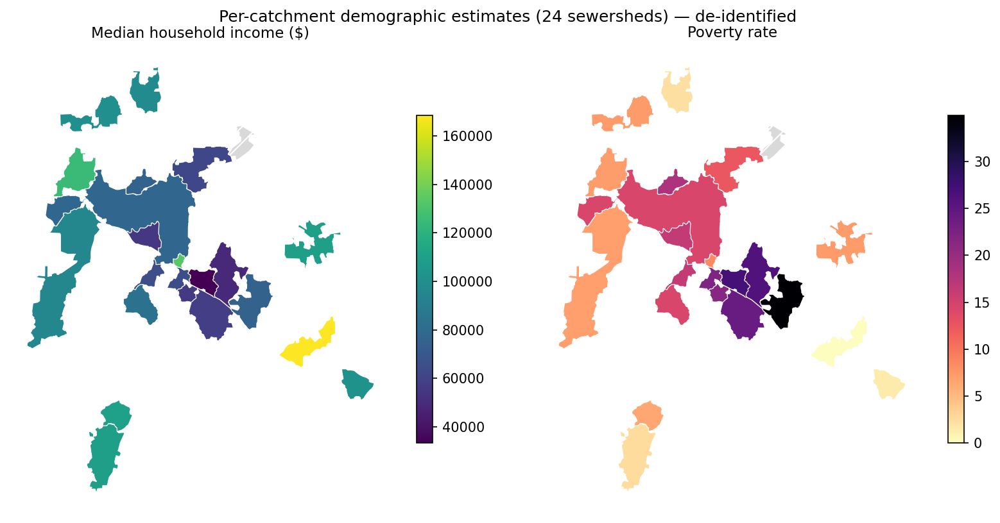

# Demographics walkthrough — real-geography run

The demographic-join phase apportions Census population characteristics into each
delineated sewershed. It **cannot run on the synthetic toy example** — it needs real
Census geography (FIPS-coded blocks/block-groups) and a free Census API key — so this
walkthrough documents a run against a real network instead. The figures below are
rendered from real outputs, **de-identified**: no basemap, no asset IDs, no
coordinates ([policy](decision_log.md), 2026-07-12).

## What it computes, per sewershed

| Group | Variables | Source |
|---|---|---|
| Race / ethnicity | % white, Black, Asian, AmInd, NHPI, other, 2+, Hispanic | 2020 Decennial (PL 94-171), block level |
| Income | pooled median household income | ACS 5-yr B19001 (binned), block-group level |
| Poverty | poverty rate + MOE | ACS 5-yr C17002 (income-to-poverty ratio < 1.00) |
| SNAP | SNAP-household rate + MOE | ACS 5-yr B19058 |
| Property | mean / median assessed parcel value | assessor parcel layer (no census) |

**Method in one paragraph:** population does not spread evenly over a catchment, so
plain area-weighting over-counts parks, highways, and industrial land. Instead, each
census unit's weight is the fraction of its **residential parcel area** that falls
inside the sewershed (dasymetric apportionment, after Hill & Larsen 2023). Counts are
then Σ weight × value; margins of error follow the Census aggregation rules
(root-sum-of-squares for counts, the Census proportion formula for rates). Median
income is pooled from the binned B19001 distribution and interpolated — never a
median of medians.

## Prerequisites

1. Delineated catchments on disk — `output/sewershed_final.gpkg` (`boundary` layer),
   produced by `run.py` (see the README quickstart).
2. A **free Census API key** — sign up at
   <https://api.census.gov/data/key_signup.html> (instant). Expose it one of three
   ways (checked in this order):
   - env var `CENSUS_API_KEY`
   - a one-line file `.census_api_key` in the project root (gitignored — never commit it)
   - `inputs.census_api_key` in `config.yaml`

## Run

```bash
# 1. Delineate (if not already done) — writes output/sewershed_final.gpkg
python run.py --config config.yaml --sites-file sites.csv

# 2. Pull census tables (cached locally) + apportion into every catchment
python run_demographics.py --config config.yaml

# Offline re-run against the existing cache (no key needed):
python run_demographics.py --config config.yaml --skip-fetch
```

Outputs land at `output/demographics/sewershed_demographics.csv` (full 34-column
table, dashboard-friendly) and `.shp` (headline fields, 10-char DBF names).

## Configuration that matters

From `config.yaml` — point these at your study area:

```yaml
census:
  state_fips: "37"            # your state
  county_fips: "063"          # your county
  decennial_vintage: 2020     # pinned (race/ethnicity full count)
  acs5_vintage: "latest"      # PIN to a year for a reproducible paper run

demographics:
  land_use_desc_column: "PARUSEDESC"     # parcel land-use description field
  residential_desc_prefixes: ["RES/"]    # what counts as residential...
  residential_desc_contains: ["APT", "CONVERTED RESID"]   # ...incl. apartments
  property_value_col: "PARVAL"           # assessor total value field
```

The residential-mask rules are the study-area-specific part: check how *your*
parcel layer encodes land use and adjust the prefixes/tokens. Vacant land is always
excluded, whatever else matches.

## Example output



Real 24-catchment run (poverty rate in percent). Internal consistency checks out:
poverty and SNAP track income inversely, race composition varies by catchment. The
grey hatched catchment reports ~zero population — a genuinely industrial area whose
census blocks hold people *outside* the catchment boundary; the residential mask
correctly zeroes it rather than smearing those residents in.

Regenerate this figure from your own run (de-identification enforced by the script —
no basemap, no IDs, axes off):

```bash
python run_walkthrough_figures.py --config config.yaml
```

## Honest caveat — estimates, not measurements

The catchment *polygons* are validated (median IoU 0.875 / LOO 0.863 vs expert manual
delineation — see the README). The demographic numbers apportioned into them are
**not validated and cannot be**: no ground truth exists for the demographics of a
sewershed's contributing population. Treat every value as an estimate with stated
uncertainty. Specific approximations to keep in mind:

- The dasymetric assumption: population is proportional to residential parcel *area*
  within each census unit (a large-lot house counts more land than an apartment
  footprint; apartment prefixes partially compensate).
- The pooled median's open-topped bin returns its floor ($200k+), understating
  medians in very high-income catchments.
- Pooled median income has **no propagated MOE** (count-based error propagation is
  invalid for an interpolated median).
- Decennial counts carry no MOE (full count); ACS estimates do, and it is propagated
  where the Census rules allow.
